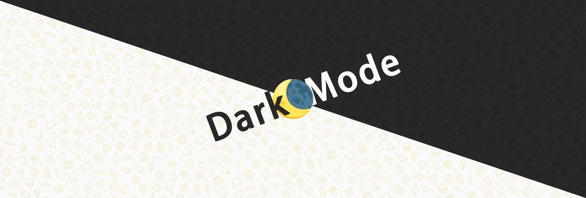

# 

<p align="center"><i>The idea of Logo comes from Emoji fusion device</i></p>

 
[](https://github.com/Melon-Studio/DarkMode2/blob/master) 
[](https://github.com/Melon-Studio/DarkMode2/blob/master) 
[](https://github.com/Melon-Studio/DarkMode2/blob/master) 
[](https://github.com/Melon-Studio/DarkMode2/blob/master) 
[](https://camo.githubusercontent.com/e9fbca5d0b8195869f2368539ad6eb31d979abd866bb8e4fc3165b5fae627f9a/68747470733a2f2f696d672e736869656c64732e696f2f6769746875622f6c6173742d636f6d6d69742f4d656c6f6e2d53747564696f2f4461726b4d6f6465323f7374796c653d666c61742d737175617265) 
[](https://camo.githubusercontent.com/05e612beecc0f77dc26faecb1b367a4323d11713fbc50c9a0904cca36fd24de2/68747470733a2f2f696d672e736869656c64732e696f2f6769746875622f64697363757373696f6e732f4d656c6f6e2d53747564696f2f4461726b4d6f6465323f7374796c653d666c61742d737175617265)

[简体中文](./README.md) | English

**The project has been discontinued for maintenance by the author since 2024/01/17, and the recovery time is to be determined.**

DarkMode2 is an open-source software designed to automatically switch the color mode of Windows 10/11 systems. It offers several key features, including scheduled switching, sunrise-sunset switching, ambient light-based switching, and switching based on system native wallpapers and Wallpaper Engine wallpapers. The software aims to address the lack of automatic color mode switching in the Windows operating system. Additionally, it provides various extra functionalities. Automatically switching to dark mode at night helps reduce eye fatigue and prevents excessive light from entering the eyes. While this software cannot completely solve eye fatigue, it can alleviate the eye strain caused by using light mode at night.

---

## 👁️Features

- **Scheduled Switching**: Automatically switches the system's color mode based on a user-defined schedule.
- **Sunrise-Sunset Switching**: Adjusts the color mode automatically based on the user's location's sunrise and sunset times.
- **Ambient Light-based Switching**: Automatically switches the color mode based on changes in ambient light.
- **System Native Wallpaper Switching**: Automatically adjusts the set system native wallpaper based on the color mode.
- **Wallpaper Engine Wallpaper Switching**: Automatically adjusts the set Wallpaper Engine wallpaper based on the color mode.

More features are in development; feel free to submit issues to add functionality suggestions to the lab.

---

## 📀System Requirements

- **Operating System**: Windows 10 / 11
- **System Architecture**: x64 / arm64
- **Required Framework**: .NET Framework 4.7.2
  
If your system doesn't have the framework, [click here](https://dotnet.microsoft.com/en-us/download/dotnet-framework/thank-you/net472-web-installer) to install it.

---

## 🖱️Installation and Usage

1. [Click here](https://github.com/Melon-Studio/DarkMode2/releases) or on the right for Releases to download the latest version.
2. In the local folder, double-click to run `DarkMode 2.exe`.
3. Configure as needed and save the settings.
4. DarkMode2 will run in the background and automatically switch the color mode based on your settings.

---

## 😶‍🌫️Q&A

1. What should I do if there are errors or program exceptions?

 - Recommended: Search for 
Registry Editor in Windows search, open it, and enter 
`Computer\HKEY_CURRENT_USER\Software\DarkMode2` in the address bar. Delete the 
`DarkMode2` entry (folder).
 - In some cases: In the settings center, click the 
`Reset User Configuration button`

2. How can I avoid frequent UAC prompts?

If you encounter UAC prompts when starting up, it means you have enabled automatic sunrise-sunset time updates. This is because the software automatically updates sunrise-sunset time on startup, and it cannot avoid invoking administrator privileges. Alternatively, it might be triggered by UAC prompts when modifying system registry items during switching. If you want to prevent UAC prompts permanently, you can right-click on 

`DarkMode 2.exe` -> select `Properties` -> select `Run this program as an administrator`.

## 🧷Open Source License

This open-source project follows the international MIT open-source license. Please read the LICENSE file for details. You can use all the code of DarkMode2 in personal or commercial projects, but you must include a copy of the MIT open-source license in your referenced project.

This project uses third-party open-source libraries:
			
| Name        | Author            | Copyright                                                         | License       |
| ----------- | --------------- | ------------------------------------------------------------ | ---------- |
| NHotKey.Wpf | Thomas Levesque | Copyright © 2020 Thomas Levesque Licensed under the Apache-2.0 License. | Apache-2.0 |
| WPF-UI      | lepo.co         | Copyright © 2022 lepo.co Licensed under the MIT License.     | MIT        |
| Log4net     | Apache          | Copyright © 2022 Apache Licensed under the Apache-2.0 License. | Apache-2.0 |
| ...         | ...             | ...                                                          | ...        |


For more dependencies, please check [here](https://github.com/Melon-Studio/DarkMode2/network/dependencies).

---

## 🥰Acknowledgments

DarkMode2 extends special thanks to  [Microsoft Visual Studio](https://visualstudio.microsoft.com/)  for providing powerful development tools and support.


---

## ⚡Support the Project

To continue providing free software services, we have opened up sponsorship channels. Through this channel, you can voluntarily sponsor our software project, which is very important for our development.

As developers, we know that our growth and software development are inseparable from your support and encouragement. Your sponsorship will be directly used to improve the quality, functionality, and user experience of the software, as well as to invest more time and effort in developing new features and functionalities.

We solemnly promise that our software will always be free and will remain updated, whether now or in the future. We always believe that the power of open-source software lies in sharing and collaboration. By providing free software, we can bring practical and high-quality products to more users.

Thank you to every user willing to sponsor us, regardless of the amount of your sponsorship. Your support will inspire me to continue working hard and improving the quality of the software. Your sponsorship will also be the driving force behind our progress and ongoing development.

Sponsorship Channel: https://afdian.net/a/DarkMode2

---

## 🎉Contribution

If you're interested in contributing to DarkMode2, you can follow these steps:

1. Fork the warehouse and clone your Forked warehouse locally:
```
git clone https://github.com/YouUserName/DarkMode2.git
```
2. Make your modifications locally.
3. Commit your changes and create a Pull Request (PR).
4. We'll review your PR and merge your contributions once approved.

Thanks to all developers who contribute to DarkMode2!

<a href="https://github.com/Melon-Studio/DarkMode2/graphs/contributors">
  
</a>

---

## 📶Trends
Here's the recent star trend chart for this project:

[](https://star-history.com/#Melon-Studio/DarkMode&Melon-Studio/DarkMode2&Date)

Please note that this is just a sample chart showing recent trends for the project, and does not represent actual data.

Feel free to follow and star our project! Your support is greatly appreciated!
